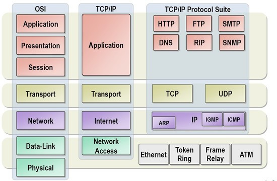

# [CS] HTTP 네트워크

### RESTful API

REST란 Representational State Transfer의 약자로써 여기에 ~ful이란 형용사형 어미를 붙여 REST한 API라는 표현으로 사용된다. 즉, REST의 기본 원칙을 성실히 지킨 서비스 디자인은 RESTful하다고 표현할 있다.

REST는 **디자인 패턴이다** 혹은 **아키텍처다**라는 의견이 분분한데, 하나의 아키텍처로 볼 수 있다. 좀 더 정확한 표현으로 말하자면 REST는 Resource Oriented Architecture이다. API 설계의 중심에 자원(Resource)가 있고, HTTP Method를 통해서 자원을 처리하도록 설계하는 것이다.

#### REST 6가지 원칙

- Uniform Interface
- Stateless
- Caching
- Client-Server
- Hierarchical System
- Code on Demand

#### RESTful하게 API를 디자인한다는 것

1. **리소스와 행위를 명시적이고 직관적으로 분리**
   - 리소스는 URI로 표현되는데 리소스가 가리키는 것은 **명사**로 표현되어야 한다.
   - 행위는 HTTP Method로 표현하고 GET, POST, PUT, PATCH, DELETE 등 분명한 목적으로 사용해야 한다.
2. **Message는 Header와 Body를 명확하게 분리해서 사용**
   - Entity에 대한 내용은 Body에 담는다.
   - 애플리케이션 서버가 행동할 판단의 근거가 되는 컨트롤 정보인 API 버전 정보, 응답 받고자하는 MIME 타입 등은 Header에 담는다.
   - Header와 Body는 HTTP Header와 HTTP Body로 나눌 수 있고, HTTP Body에 들어가는 JSON 구조로 분리할수도 있다.
3. **API 버전을 관리**
   - 환경은 항상 변하기 때문에 API Signature가 변경될 수 있음에 유의해야 한다.
   - 특정 API를 변경할 때는 반드시 하위 호환성을 보장해야 한다.
4. **서버와 클라이언트가 같은 방식을 사용해서 요청**
   - 브라우저는 Form-Data 형식으로 요청하고, 서버에서는 JSON 형태로 응답하는 식의 분리보다는 JSON으로 보내든, From-Data 형식으로 보내든 하나로 통일한다.
   - 다른 말로 표현하자면 URI가 플랫폼 중립적이어야 한다.

#### 장점

- OpenAPI 제공이 쉬움
- 멀티플랫폼(웹, 모바일, etc.) 지원 및 연동이 용이
- 원하는 타입으로 데이터를 주고 받을 수 있음
- 기존 웹 인프라(HTTP)를 그대로 사용할 수 있음

#### 단점

- 분산 환경에 부적합
- HTTP 통신 모델에 대해서만 지원

### HTTP Method - GET vs POST

> 둘 다 HTTP 프로토콜을 이용해서 서버에 무언가 요청할 때 사용하는 방식

#### GET

HTTP Body 없이 요청 데이터가 URL에 담겨서 전송된다. 때문에 URL의 `?` 뒤에 데이터가 붙어서 Request를 보내게 된다. 이러한 방식은 URL이라는 공간에 담겨서 가기 때문에 전송할 수 있는 데이터의 크기가 제한적이다. 또한, URL에 데이터가 노출되므로 보안이 필요한 데이터의 경우에는 적합하지 않다.

#### POST

POST 방식의 Request는 HTTP Request Message의 Body 부분에 데이터가 담겨서 전송된다. 때문에 Binary 데이터를 요청하는 경우 POST 방식으로 보내야하는 것처럼 데이터 크기가 GET보다 크고, 보안면에서 안정적이다. 하지만 별도로 암호화 하지 않는 이상 크게 안전하지는 않다. => Request Message를 탈취해서 Parsing하면 도청 가능

#### 차이

GET은 가져오는 것. 즉, 서버의 데이터를 가져와서 보여준다. SQL Query의 SELECT와 비슷한 동작이며, 서버의 상태나 값을 변경하는 것은 아니다.

반면에 POST는 서버의 값이나 상태를 변경하거나 추가하기 위해 사용된다.

그 밖에, GET 방식의 요청은 브라우저에서 캐싱할 수 있다. 때문에 POST 방식으로 요청해야할 것을 보내는 데이터의 크기가 작고 보안적인 문제가 없다는 이유로 GET 방식으로 요청한다면, 기본에 캐싱되었던 데이터가 응답될 가능성이 존재한다.

### TCP와 UDP

#### UDP

- 비연결성 프로토콜
- 비신뢰적인 프로토콜
- IP 데이터그램을 캡슐화하여 보내는 방법과 연결 설정을 하지 않고 보내는 방법 제공
- UDP는 흐름제어, 오류제어 또는 손상된 세그먼트 수신에 대한 재전송을 하지 않음
- UDP가 행하는 것은 Port들을 사용하여 IP 프로토콜에 인터페이스를 제공하는 것

#### TCP

대부분의 인터넷 응용 분야들은 신뢰성과 순차적인 전달을 필요로 하는데, UDP로는 이를 만족시킬 수 없다. TCP는 신뢰성이 없는 인터넷을 통해 종단간에 신뢰성이 있는 바이트 스트림을 전송하도록 특별히 설계되었다. TCP는 서비스 송신자와 수신자 모두가 **소켓이라고 부르는 종단점**을 생성함으로써 이루어진다. TCP에서 연결 설정은 3-Way Handshake를 통해 행해진다.

모든 TCP 연결은 전이중(Full duplex), 점대점(Point to Point) 방식이다. 전이중이란 전송이 양방향으로 동시에 일어날 수 있음을 의미하며, 점대점이란 각 연결이 정확히 두 개의 종단점을 가지고 있음을 의미한다. TCP는 멀티캐스팅이나 브로드캐스팅을 지원하지 않는다.

### HTTP vs HTTPS

- HTTP는 평문이기 때문에 도청 가능
- 통신 상대를 확인하지 않기 때문에 위장 가능
- 완전성을 증명할 수 없기 때문에 변조 가능

위 세 가지는 다른 암호화되지 않은 프로토콜에도 공통적으로 적용되는 문제점

#### TCP/IP는 도청 가능한 네트워크

TCP/IP 구조의 통신은 전부 통신 경로 상에서 엿볼 수 있고, 패킷을 수집하는 것만으로 도청이 가능하다. 평문으로 통신할 경우 메시지의 의미를 파악할 수 있기 때문에 암호화하여 통신해야한다.

**보완방법**

- 통신 자체를 암호화 **SSL 혹은 TLS** 라는 다른 프로토콜을 조합함으로써 HTTP 통신 내용을 암호화 할 수 있다. SSL을 조합한 HTTP를 HTTPS라고 한다.
- 컨텐츠의 암호화, 말 그대로 HTTP를 사용해서 운반하는 내용인 HTTP Message에 포함되는 컨텐츠만 암호화 처리하는 것이다. 암호화해서 전송하면 받은 측에서는 그 암호를 해독하여 출력하는 처리가 필요하다.

#### 통신 상대를 확인하지 않기 때문에 위장 가능

- 요청을 보낸 쪽이 웹 서버가 원래 의도한 응답을 보내야하는 곳인지 확인 불가
- 응답을 반환한 곳의 클라이언트가 원래 의도한 요청을 보낸 클라이언트인지 확인 불가
- 통신하고 있는 상대가 접근이 허가된 상대인지 확인 불가
- 어디에서 누가 요청했는지 확인 불가
- 의미없는 요청도 수신 => DDos 공격 방지 불가

**보완방법**

SSL을 통해 상대 확인이 가능하다. SSL은 증명서를 제공하는데, 증명서는 신뢰할 수 있는 제 3자 기관(CA기관)에 의해 발행되는 것이기 때문에 서버나 클라이언트가 실재하는 사실을 증명한다. 이 증명서를 이용함으로써 통신 상대가 내가 통신하고자 하는 서버임을 알 수 있고, 사용자는 개인정보 누설 등의 위험성이 줄어들게 된다. 또한, 클라이언트는 이 증명서로 본인 확인을 하고 웹 사이트 인증에서도 사용이 가능하다.

#### 완전성을 증명할 수 없기 때문에 변조 가능

**완전성**이란 정보의 정확성을 의미한다. 서버 또는 클라이언트에서 수신한 내용이 송신 측에서 전송한 내용과 일치한다는 것을 보장할 수 없다. 요청 및 응답이 발신된 후 누군가에 의해 변조되더라도 이 사실을 알 수 없다. 이와 같이 공격자가 도중에 응답을 빼앗아 변조하는 공격을 **중간자 공격**이라고 부른다.

**보완방법**

MD5, SHA-1 등의 해시값을 확인하는 방법과 파일의 디지털 서명을 확인하는 방법이 존재한다. 하지만 확실히 확인할 수 있는 것은 아니며, 확실히 방지하기 위해선 HTTPS를 사용해야 한다. SSL은 인증이나 암호화 그리고 다이제스트 기능을 제공한다.

### HTTPS

HTTPS는 SSL 껍데기를 뒤집어 쓴 HTTP라고 할 수 있다. 즉, 새로운 응용 프로토콜이 아니고, HTTP 통신을 하는 소켓 부분을 SSL 프로토콜로 대체하는 것일 뿐이다. 원래 HTTP는 TCP와 직접 통신을 했지만, HTTPS에서는 SSL과 통신하고, SSL이 TCP와 통신하게 된다. SSL을 사용한 HTTPS는 암호화와 증명서, 안전성 보호를 이용할 수 있게 된다.

HTTPS의 SSL에서는 대칭키 암호화 방식과 공개키 암호화 방식을 혼합한 하이브리드 암호 시스템을 사용한다. 대칭키를 공개키 방식으로 교환한 후 다음부터 통신은 대칭키를 이용하는 방식이다.

- **공개키 암호화** : 공개키, 비밀키 두 가지가 존재
- **대칭키 암호화** : 하나의 대칭키만 존재

#### 모든 웹 페이지에서 HTTPS를 사용해도 될까?

평문 통신에 비해 암호화 통신은 CPU나 메모리 등 자원을 더 많이 요구한다. 통신할 때마다 암호화를 하면 추가적인 리소스를 소비하기 때문에 서버 한 대 당 처리할 수 있는 요청의 수가 상대적으로 줄어든다.

하지만 최근 하드웨어 발달로 인해 HTTPS를 사용하더라도 속도저하가 거의 일어나지 않는다. 새로운 표준인 HTTP 2.0을 함께 이용한다면 오히려 HTTPS가 HTTP보다 더 빠르게 동작한다. 따라서 웹은 민감한 정보를 다룰때만 HTTPS 암호화 통신을 사용하던 과거 방식에서 모든 웹 페이지에서 HTTPS를 적용하는 방향으로 바뀌어가고 있다.

### OSI 7계층

- 프로토콜을 기능 별로 나눈 것
- 각 계층은 하위 계층의 기능만을 이용하고, 상위 계층에게 기능을 제공
- 프로토콜 스택 혹은 스택은 이러한 계층들로 구성되는 프로토콜 시스템이 구현된 시스템을 가리킴. 프로토콜 스택은 하드웨어나 소프트웨어 혹은 둘의 조합으로 구현될 수 있음
- 일반적으로 하위 계층들은 하드웨어로, 상위 계층들은 소프트웨어로 구현됨