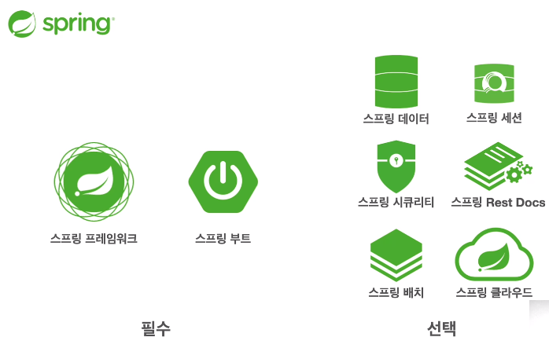

# 스프링이란

### 스프링 생태계

#### 필수

- **스프링 프레임워크**
  - **핵심 기술** : 스프링 DI 컨테이너, AOP, 이벤트 등
  - **웹 기술** : 스프링 MVC, 스프링 WebFlux 등
  - **데이터 접근 기술** : 트랜잭션, JDBC, ORM 지원, XML 지원 등
  - **기술 통합** : 캐시, 이메일, 원격접근, 스케줄링 등
  - **테스트** : 스프링 기반 테스트 지원
  - **언어** : 코틀린, 그루비
- **스프링 부트**
  - 스프링을 **편리하게 사용할 수 있도록 지원**, 최근에는 **기본으로 사용**
  - Tomcat과 같은 **웹 서버를 내장**해서 별도의 웹 서버를 설치하지 않아도 됨
    - Embedded Tomcat 등
  - 손쉬운 빌드 구성을 위한 **starter 종속성** 제공
    - spring-boot-starter-web 등
  - 스프링과 **3rd party(외부) 라이브러리 자동 구성**
  - 메트릭, 상태 확인, 외부 구성 같은 프로덕션 준비 기능 제공
  - 관례에 의한 **간결한 설정**

#### 선택

- **스프링 데이터** : 어떤 데이터베이스든 기본적인 CRUD를 편리하게 사용하도록 함
- **스프링 세션** : 세션 기능을 편리하게 사용할 수 있게 함
- **스프링 시큐리티** : 보안 관련
- **Rest Docs** : API 문서 작성 관련
- **스프링 배치** : Batch 처리에 특화된 기술

그 밖에도 아주 많은 선택 기술들이 있다.

> **스프링이라는 단어에 대해**

- 스프링이라는 단어는 문맥에 따라 다르게 사용됨
  - 스프링 DI 컨테이너 기술
  - 스프링 프레임워크
  - 스프링 부트, 스프링 프레임워크 등을 모두 포함한 스프링 생태계

### 스프링을 왜 만들었나

- **EJB** 기반 개발은 EJB에 **의존적**이고 **종속적**이다.
  - Java의 객체 지향성을 살리지 못함
- **스프링의 핵심 컨셉**
  - 스프링은 Java 언어 기반의 프레임워크
  - Java의 가장 큰 특징은 **객체 지향 언어**
  - 스프링은 객체 지향 언어가 가진 강력한 특징을 살려내는 프레임워크
  - 스프링은 **좋은 객체 지향 애플리케이션**을 개발할 수 있게 도와주는 프레임워크