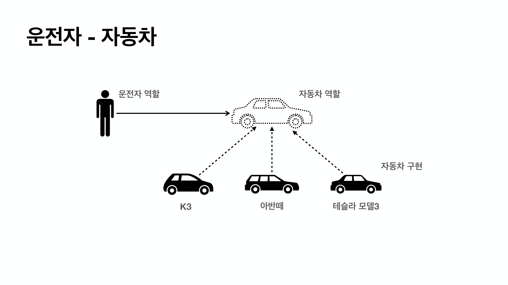

# 좋은 객체 지향 프로그래밍

### 객체 지향의 특징

- 추상화
- 캡슐화
- 상속
- 다형성

### 객체 지향 프로그래밍

- 객체 지향 프로그래밍은 컴퓨터 프로그램을 명령어의 목록으로 보는 시각에서 벗어나 여러 개의 독립된 단위, 즉 **객체의 모임**으로 파악하고자 하는 것이다. 각각의 객체는 **메시지**를 주고 받고, 데이터를 처리할 수 있다.(**협력**)
- 객체 지향 프로그래밍은 프로그램을 **유연**하고 **변경이 용이**하게 만들기 때문에 대규모 소프트웨어 개발에 많이 사용된다.
  - 레고 블럭을 조립하듯이
  - 키보드, 마우스를 갈아 끼우듯이
  - 컴퓨터 부품을 갈아 끼우듯이
  - **컴포넌트를 쉽고 유연하게 변경하면서 개발할 수 있는 방법** => (**다형성**, Polymorphism)

### 다형성의 실세계 비유

- 실세계와 객체 지향을 1:1로 매칭하기는 어렵다.
- 그래도 실세계의 비유로 이해하기는 좋다.
- **역할**과 **구현**으로 세상을 구분

운전자는 자동차가 바뀌어도 운전을 할 수 있다. 자동차의 역할은 그대로고, 그 구현체가 변경된 것이기 때문 -> 운전자는 자동차 역할(인터페이스)에 대해서만 의존하고 있다.

- 운전자(클라이언트)는 자동차의 내부를 알 필요가 없다.
- 자동차 역할만 알고 있으면 구현이 내부적으로 바뀌어도 클라이언트에게 영향을 주지 않는다.
- 심지어, 아반떼를 테슬라 모델3(완전히 새로운 차)로 바꿔도 운전자를 바꿀 필요는 없다.
- 즉, **클라이언트에 영향을 주지 않고 새로운 기능을 제공할 수 있다.**

로미오 역할을 장동건이나 원빈이 할 수 있고, 줄리엣 역할을 김태희나 송혜교가 할 수 있다. 나아가 무명 배우라도 줄리엣 역할을 할 수 있다. 공연을 할 때, 배우는 대체가 가능해야한다. 마찬가지로 내부 구조에 대해서는 서로 몰라도 된다. 로미오가 줄리엣이 누가 되던 공연을 진행할 수는 있다.

#### 그 밖의 예시

- 키보드, 망스, 세상의 표준 인터페이스들
- 정렬 알고리즘
- 할인 정책 로직
- etc.

## 역할-구현 분리

- **역할**과 **구현**으로 구분하면 세상이 **단순**해지고, **유연**해지며 **변경도 편리**해진다.
- **장점**
  - 클라이언트는 대상의 **역할**(인터페이스)**만 알면 된다.**
  - 클라이언트는 구현 대상의 **내부 구조를 몰라도 된다.**
  - 클라이언트는 구현 대상의 **내부 구조가 변경**되어도 영향을 받지 않는다.
  - 클라이언트는 구현 **대상 자체를 변경**해도 영향을 받지 않는다.
- **Java 언어**
  - Java의 **다형성**을 활용
    - **역할** : 인터페이스
    - **구현** : 인터페이스를 구현한 클래스, 구현 객체
  - 객체를 설계할 때 **역할과 구현을 명확히 분리**
  - 객체 설계시 역할(인터페이스)을 먼저 부여하고, 그 역할을 수행하는 구현 객체 만들기

### 객체의 협력이라는 관계부터 생각하기

- 혼자 있는 객체는 없다!
- 클라이언트 : **요청** / 서버 : **응답**
- 수 많은 객체 클라이언트와 객체 서버는 서로 협력 관계를 가진다.

### Java의 다형성

- **오버라이딩**을 떠올려보자
- 오버라이딩은 Java 기본 문법
- 오버라이딩 된 메서드가 실행
- 다형성으로 인터페이스를 구현한 객체를 실행 시점에 유연하게 변경할 수 있다.
- 물론 클래스 상속 관계도 다형성, 오버라이딩 적용 가능

### 다형성의 본질

- 인터페이스를 구현한 객체 인스턴스를 **실행 시점에 유연하게 변경할 수 있다.**
- 다형성의 본질을 이해하려면 **협력**이라는 객체 사이의 관계에서 시작해야한다.
- **클라이언트를 변경하지 않고, 서버의 구현 기능을 유연하게 변경할 수 있다.**

> **요약**

- 실세계의 역할과 구현이라는 편리한 컨셉을 다형성을 통해 객체 세상으로 가져올 수 있음
- 유연하고, 변경이 용이
- 확장 가능한 설계
- 클라이언트에 영향을 주지 않는 변경 가능
- 인터페이스를 안정적으로 잘 설계하는 것이 중요

> **한계**

- 역할(인터페이스) 자체가 변하면 클라이언트, 서버 모두에 큰 변경이 발생한다.
  - 자동차를 비행기로 변경해야 한다면? 
  - 대본 자체가 변경된다면?
  - USB 인터페이스가 변경된다면?
- 인터페이스를 안정적으로 잘 설계하는 것이 중요

## 스프링과 객체 지향

- **다형성이 가장 중요하다!**
- 스프링은 다형성을 극대화해서 이용할 수 있게 도와준다.
- 스프링에서 이야기하는 **제어의 역전(IoC)**, **의존관계 주입(DI)**은 다형성을 활용해서 역할과 구현을 편리하게 다룰 수 있도록 지원한다.
- 스프링을 사용하면 마치 레고 블럭 조립하듯이, 공연 무대의 배우를 선택하듯이 구현을 편리하게 변경할 수 있다.

